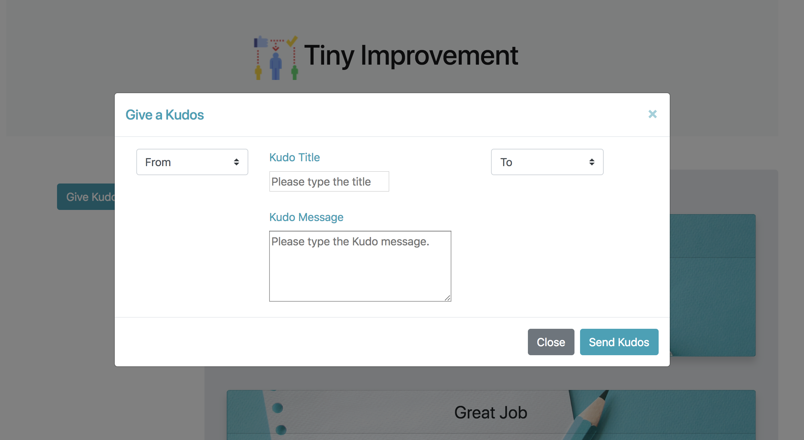
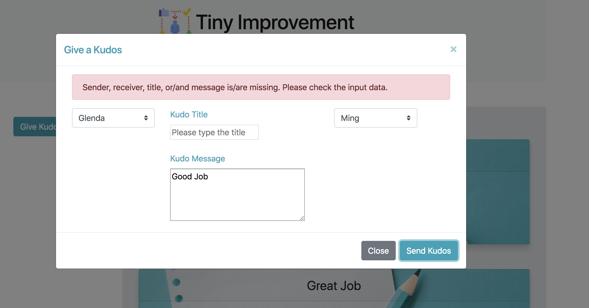

# Tiny-Improvements
___

## Description
___

This is an application called Tiny Improvement that allows users to send compliments or "Kudos" to other users that are then displayed on the page for all to see. 

## Structure of Files
___

Public\
 * index.html: The home page of Tiny Improvement.
 * app.js: Javascript on the client side.
 * assets Folder: Store all images and css file for the index.html and app.js.

 Config
 * config.json: Configuration setup for the server.

 Models
 * Kudos.js: A collection for Kudo data.
 * User.js: A collection for User data.

 Routes
 * apiRoute.js: HTTP call javescript
 * html-route.js: A route to display index.html.

 Main
 * server.js: Start a server.

 ***How to use***

 1. Go to [Tiny Improvement Site](https://floating-oasis-34350.herokuapp.com/ ). Initially all kudos in the Database will be displayed.

2. Click on  Give Kudos button. This will pop up a window.

3. Select the sender, receiver, and all other information and click on Send Kudo Screen. If there is a missing information, then the message will be displayed.

4. After submitting the kudos, it goes back to the original page.

## Author
___

Makiko Vaughan(makiko.vaughan@gmail.com)